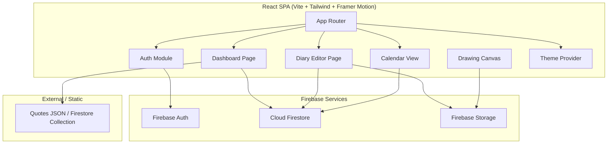
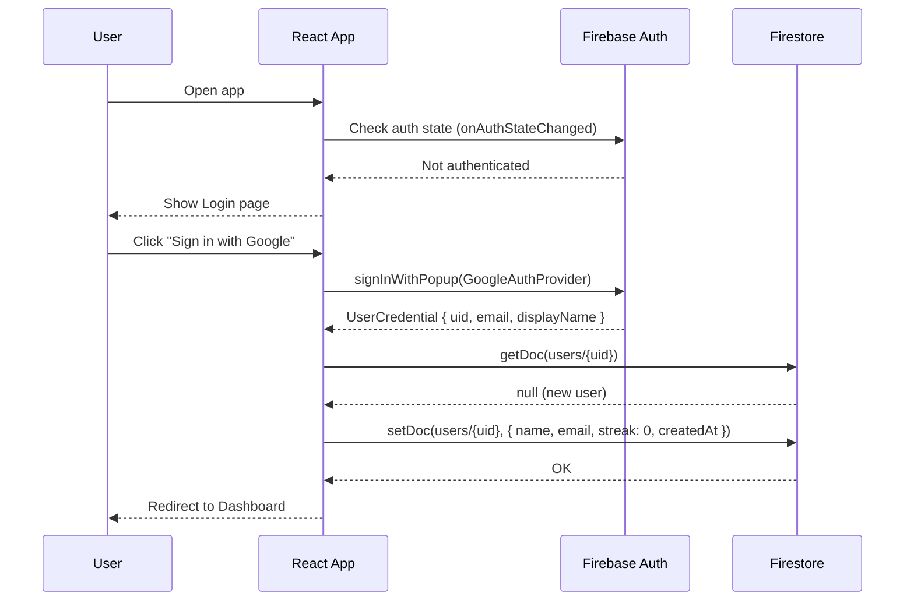
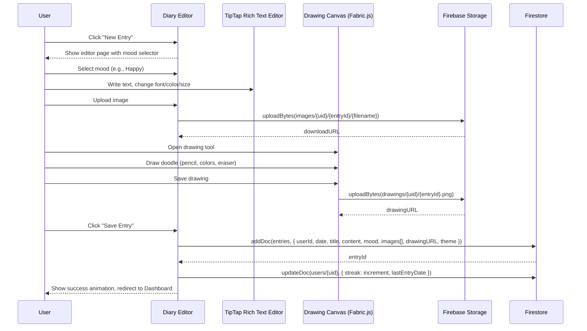
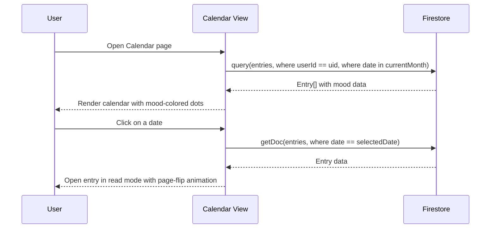

# Design Document: DearMe — Digital Diary Application

## Overview

DearMe is a warm, aesthetic, and safe digital diary web application built with React, Tailwind CSS, Framer Motion, and Firebase. It provides users with a beautiful, private space to write daily entries, customize text styling, upload pictures, create doodles on a canvas, and receive motivational quotes — all wrapped in a page-flip diary experience with pastel themes.

The application targets students, long-distance couples, mental wellness users, creative teens, and aesthetic-focused users. The architecture follows a client-heavy SPA pattern with Firebase handling authentication, database (Firestore), and file storage. The UI emphasizes soft pastel palettes, rounded edges, handwritten fonts, floating animations, and smooth page transitions powered by Framer Motion.

The development is phased: Phase 1 covers auth and basic diary writing; Phase 2 adds rich text editing, color customization, and image uploads; Phase 3 introduces the drawing canvas, calendar view, and streak heatmap; Phase 4 delivers themes, animations, and the quotes system.

## Architecture



## Sequence Diagrams

### Authentication Flow



### Diary Entry Creation Flow



### Calendar View Flow



## Components and Interfaces

### Component 1: AuthProvider

**Purpose**: Manages Firebase authentication state and provides auth context to the entire app.

```typescript
interface AuthContextType {
  user: User | null;
  loading: boolean;
  signInWithGoogle: () => Promise<void>;
  signInWithEmail: (email: string, password: string) => Promise<void>;
  signUp: (email: string, password: string, name: string) => Promise<void>;
  signOut: () => Promise<void>;
  verifyPin: (pin: string) => boolean;
  setPin: (pin: string) => Promise<void>;
}
```

**Responsibilities**:
- Listen to Firebase auth state changes
- Provide sign-in/sign-up/sign-out methods
- Manage diary PIN lock feature
- Create user document in Firestore on first sign-up

### Component 2: DiaryEditor

**Purpose**: Rich text diary entry editor with TipTap, image upload, and drawing integration.

```typescript
interface DiaryEditorProps {
  entryId?: string;           // undefined for new entry, string for editing
  initialContent?: JSONContent; // TipTap JSON content for editing
  onSave: (entry: DiaryEntryInput) => Promise<void>;
}

interface DiaryEntryInput {
  title: string;
  content: JSONContent;       // TipTap rich text as JSON
  mood: Mood;
  images: string[];           // Firebase Storage download URLs
  drawingURL?: string;
  theme: ThemeName;
  date: Date;
}
```

**Responsibilities**:
- Render TipTap editor with font, size, color, and background customization toolbar
- Handle image upload to Firebase Storage and embed URLs in entry
- Integrate drawing canvas as a modal/panel
- Auto-save drafts to localStorage
- Save finalized entry to Firestore

### Component 3: DrawingCanvas

**Purpose**: Fabric.js-powered canvas for freehand doodles with pencil, eraser, and color tools.

```typescript
interface DrawingCanvasProps {
  width: number;
  height: number;
  onSave: (dataURL: string) => void;
  onClose: () => void;
}

interface DrawingToolState {
  tool: 'pencil' | 'eraser';
  color: string;
  brushSize: number;
}
```

**Responsibilities**:
- Initialize Fabric.js canvas with drawing mode
- Provide pencil, eraser, color picker, and brush size controls
- Export canvas as PNG data URL
- Upload exported image to Firebase Storage

### Component 4: Dashboard

**Purpose**: Landing page after login showing greeting, streak, mood selector, and quote of the day.

```typescript
interface DashboardData {
  userName: string;
  streak: number;
  lastEntryDate: Date | null;
  quoteOfTheDay: Quote;
  recentEntries: DiaryEntrySummary[];
  moodHistory: MoodEntry[];
}

interface Quote {
  text: string;
  author: string;
  backgroundColor: string;   // pastel color
}
```

**Responsibilities**:
- Display personalized greeting based on time of day
- Show streak counter with fire emoji and heatmap
- Display random motivational quote with pastel background
- Show mood selector for quick mood logging
- List recent diary entries

### Component 5: CalendarView

**Purpose**: Monthly calendar showing entries color-coded by mood, with click-to-open functionality.

```typescript
interface CalendarViewProps {
  userId: string;
  onDateSelect: (date: Date, entry?: DiaryEntry) => void;
}

interface MoodEntry {
  date: Date;
  mood: Mood;
  hasEntry: boolean;
}
```

**Responsibilities**:
- Render monthly calendar grid
- Query Firestore for entries in the visible month
- Color-code dates by mood
- Navigate between months
- Open entry on date click with page-flip animation

### Component 6: ThemeProvider

**Purpose**: Manages the active visual theme and provides theme context.

```typescript
type ThemeName = 'pastel-pink' | 'midnight-blue' | 'soft-yellow' | 'mint-green' | 'cloud-white';

interface Theme {
  name: ThemeName;
  primary: string;
  secondary: string;
  background: string;
  surface: string;
  text: string;
  accent: string;
  paperTexture: string;       // CSS background-image URL
  shadow: string;             // Tailwind shadow class
}
```

**Responsibilities**:
- Store and switch active theme
- Persist theme preference in Firestore user document
- Provide CSS variables / Tailwind classes for active theme
- Support dark mode toggle

## Data Models

### User

```typescript
interface User {
  userId: string;             // Firebase Auth UID
  name: string;
  email: string;
  streak: number;
  longestStreak: number;
  lastEntryDate: Timestamp | null;
  pinHash: string | null;     // bcrypt hash of diary PIN
  theme: ThemeName;
  darkMode: boolean;
  createdAt: Timestamp;
}
```

**Validation Rules**:
- `name` must be 1–100 characters
- `email` must be valid email format
- `streak` and `longestStreak` must be non-negative integers
- `pinHash` is null if no PIN is set
- `theme` must be one of the defined ThemeName values

### DiaryEntry

```typescript
type Mood = 'happy' | 'sad' | 'productive' | 'romantic' | 'anxious' | 'calm' | 'neutral';

interface DiaryEntry {
  entryId: string;            // Firestore auto-generated ID
  userId: string;             // Reference to User
  date: Timestamp;
  title: string;
  content: JSONContent;       // TipTap rich text JSON
  mood: Mood;
  images: string[];           // Firebase Storage download URLs
  drawingURL: string | null;
  theme: ThemeName;           // Theme used when writing
  createdAt: Timestamp;
  updatedAt: Timestamp;
}
```

**Validation Rules**:
- `userId` must match authenticated user's UID
- `title` must be 1–200 characters
- `content` must be valid TipTap JSONContent
- `mood` must be one of the defined Mood values
- `images` array max length: 10
- `date` cannot be in the future

### Quote

```typescript
interface Quote {
  id: string;
  text: string;
  author: string;
  category: 'motivation' | 'love' | 'self-care' | 'productivity' | 'general';
}
```

**Validation Rules**:
- `text` must be 1–500 characters
- `author` must be 1–100 characters


## Key Functions with Formal Specifications

### Function 1: saveEntry()

```typescript
async function saveEntry(
  userId: string,
  input: DiaryEntryInput,
  existingEntryId?: string
): Promise<string> // returns entryId
```

**Preconditions:**
- `userId` is a valid, authenticated Firebase UID
- `input.title` is a non-empty string, length ≤ 200
- `input.content` is valid TipTap JSONContent (non-null)
- `input.mood` is a valid Mood enum value
- `input.images` is an array of valid Firebase Storage URLs, length ≤ 10
- `input.date` is not in the future
- If `existingEntryId` is provided, the entry must belong to `userId`

**Postconditions:**
- A new document is created in `entries` collection (or existing one updated)
- `createdAt` is set on new entries; `updatedAt` is always set to current timestamp
- User's streak is recalculated and updated in `users/{userId}`
- If streak increased, `longestStreak` is updated if new streak exceeds it
- Returns the Firestore document ID of the saved entry
- No other user's data is modified

**Loop Invariants:** N/A

### Function 2: calculateStreak()

```typescript
function calculateStreak(
  lastEntryDate: Date | null,
  currentDate: Date,
  currentStreak: number
): { newStreak: number; longestStreak: number; currentLongest: number }
```

**Preconditions:**
- `currentDate` is a valid Date representing today
- `currentStreak` is a non-negative integer
- `lastEntryDate` is null (no previous entries) or a valid Date ≤ `currentDate`

**Postconditions:**
- If `lastEntryDate` is null → `newStreak = 1`
- If `lastEntryDate` is yesterday → `newStreak = currentStreak + 1`
- If `lastEntryDate` is today → `newStreak = currentStreak` (no double counting)
- If `lastEntryDate` is more than 1 day ago → `newStreak = 1` (streak broken)
- `newStreak` is always ≥ 1
- Return value is a pure computation with no side effects

**Loop Invariants:** N/A

### Function 3: uploadImage()

```typescript
async function uploadImage(
  userId: string,
  entryId: string,
  file: File
): Promise<string> // returns download URL
```

**Preconditions:**
- `userId` is a valid, authenticated Firebase UID
- `entryId` is a valid string identifier
- `file` is a valid File object with MIME type in ['image/jpeg', 'image/png', 'image/gif', 'image/webp']
- `file.size` ≤ 5MB

**Postconditions:**
- File is uploaded to Firebase Storage at path `images/{userId}/{entryId}/{filename}`
- Returns a valid Firebase Storage download URL
- The URL is publicly accessible (or accessible via Firebase security rules)
- Original file is not modified

**Loop Invariants:** N/A

### Function 4: getEntriesForMonth()

```typescript
async function getEntriesForMonth(
  userId: string,
  year: number,
  month: number
): Promise<DiaryEntrySummary[]>
```

**Preconditions:**
- `userId` is a valid, authenticated Firebase UID
- `year` is a valid 4-digit year
- `month` is an integer in range [0, 11] (JavaScript Date month)

**Postconditions:**
- Returns only entries belonging to `userId`
- All returned entries have dates within the specified month and year
- Entries are sorted by date ascending
- Returns empty array if no entries exist for the month
- No entries from other users are included

**Loop Invariants:** N/A

### Function 5: getRandomQuote()

```typescript
function getRandomQuote(
  quotes: Quote[],
  previousQuoteId?: string
): Quote & { backgroundColor: string }
```

**Preconditions:**
- `quotes` is a non-empty array of valid Quote objects
- If `previousQuoteId` is provided, it should be a valid quote ID

**Postconditions:**
- Returns a Quote object with an additional `backgroundColor` field (pastel color)
- If `quotes.length > 1` and `previousQuoteId` is provided, returned quote's ID differs from `previousQuoteId`
- `backgroundColor` is a valid CSS color string from the pastel palette
- No mutation of the input `quotes` array

**Loop Invariants:** N/A

## Algorithmic Pseudocode

### Entry Save Algorithm

```typescript
async function saveEntryWorkflow(userId: string, input: DiaryEntryInput, existingEntryId?: string): Promise<string> {
  // ASSERT: userId is authenticated, input is validated
  
  // Step 1: Prepare entry document
  const now = Timestamp.now();
  const entryData: Partial<DiaryEntry> = {
    userId,
    date: Timestamp.fromDate(input.date),
    title: input.title.trim(),
    content: input.content,
    mood: input.mood,
    images: input.images,
    drawingURL: input.drawingURL ?? null,
    theme: input.theme,
    updatedAt: now,
  };

  // Step 2: Save or update entry in Firestore (transaction)
  let entryId: string;
  
  await runTransaction(db, async (transaction) => {
    if (existingEntryId) {
      // Update existing entry
      const entryRef = doc(db, 'entries', existingEntryId);
      const existingEntry = await transaction.get(entryRef);
      // ASSERT: existingEntry.exists() && existingEntry.data().userId === userId
      transaction.update(entryRef, entryData);
      entryId = existingEntryId;
    } else {
      // Create new entry
      entryData.createdAt = now;
      const entryRef = doc(collection(db, 'entries'));
      transaction.set(entryRef, entryData);
      entryId = entryRef.id;
    }

    // Step 3: Update streak (only for new entries)
    if (!existingEntryId) {
      const userRef = doc(db, 'users', userId);
      const userDoc = await transaction.get(userRef);
      const userData = userDoc.data() as User;
      
      const streakResult = calculateStreak(
        userData.lastEntryDate?.toDate() ?? null,
        input.date,
        userData.streak
      );

      transaction.update(userRef, {
        streak: streakResult.newStreak,
        longestStreak: Math.max(userData.longestStreak, streakResult.newStreak),
        lastEntryDate: Timestamp.fromDate(input.date),
      });
    }
  });

  // ASSERT: entry is saved, streak is updated, entryId is valid
  return entryId!;
}
```

### Streak Calculation Algorithm

```typescript
function calculateStreak(
  lastEntryDate: Date | null,
  currentDate: Date,
  currentStreak: number
): { newStreak: number } {
  // ASSERT: currentStreak >= 0

  if (lastEntryDate === null) {
    // First ever entry
    return { newStreak: 1 };
  }

  const lastDay = startOfDay(lastEntryDate);
  const today = startOfDay(currentDate);
  const diffInDays = differenceInCalendarDays(today, lastDay);

  if (diffInDays === 0) {
    // Already wrote today — no change
    return { newStreak: currentStreak };
  } else if (diffInDays === 1) {
    // Consecutive day — increment streak
    return { newStreak: currentStreak + 1 };
  } else {
    // Streak broken — reset to 1
    return { newStreak: 1 };
  }

  // ASSERT: result.newStreak >= 1
}
```

### Theme Application Algorithm

```typescript
const THEMES: Record<ThemeName, Theme> = {
  'pastel-pink':   { name: 'pastel-pink',   primary: '#FFB6C1', secondary: '#FFF0F5', background: '#FFF5F7', surface: '#FFFFFF', text: '#4A2040', accent: '#FF69B4', paperTexture: '/textures/paper-light.png', shadow: 'shadow-lg shadow-pink-200/50' },
  'midnight-blue': { name: 'midnight-blue', primary: '#1E3A5F', secondary: '#2C5282', background: '#1A202C', surface: '#2D3748', text: '#E2E8F0', accent: '#63B3ED', paperTexture: '/textures/paper-dark.png', shadow: 'shadow-lg shadow-blue-900/50' },
  'soft-yellow':   { name: 'soft-yellow',   primary: '#F6E05E', secondary: '#FEFCBF', background: '#FFFFF0', surface: '#FFFFFF', text: '#744210', accent: '#ECC94B', paperTexture: '/textures/paper-warm.png', shadow: 'shadow-lg shadow-yellow-200/50' },
  'mint-green':    { name: 'mint-green',    primary: '#9AE6B4', secondary: '#F0FFF4', background: '#F0FFF4', surface: '#FFFFFF', text: '#22543D', accent: '#48BB78', paperTexture: '/textures/paper-light.png', shadow: 'shadow-lg shadow-green-200/50' },
  'cloud-white':   { name: 'cloud-white',   primary: '#E2E8F0', secondary: '#F7FAFC', background: '#FFFFFF', surface: '#FFFFFF', text: '#2D3748', accent: '#A0AEC0', paperTexture: '/textures/paper-light.png', shadow: 'shadow-lg shadow-gray-200/50' },
};

function applyTheme(themeName: ThemeName, darkMode: boolean): void {
  // ASSERT: themeName is a valid key in THEMES
  const theme = THEMES[themeName];
  const root = document.documentElement;

  if (darkMode) {
    root.style.setProperty('--color-primary', theme.secondary);
    root.style.setProperty('--color-background', '#1A202C');
    root.style.setProperty('--color-surface', '#2D3748');
    root.style.setProperty('--color-text', '#E2E8F0');
  } else {
    root.style.setProperty('--color-primary', theme.primary);
    root.style.setProperty('--color-background', theme.background);
    root.style.setProperty('--color-surface', theme.surface);
    root.style.setProperty('--color-text', theme.text);
  }
  root.style.setProperty('--color-accent', theme.accent);
  root.style.setProperty('--paper-texture', `url(${theme.paperTexture})`);

  // ASSERT: all CSS custom properties are set on :root
}
```

## Example Usage

```typescript
// Example 1: Authenticate and create a new diary entry
import { signInWithGoogle } from './auth';
import { saveEntryWorkflow } from './entries';

const user = await signInWithGoogle();

await saveEntryWorkflow(user.uid, {
  title: 'A Beautiful Day ✨',
  content: { type: 'doc', content: [{ type: 'paragraph', content: [{ type: 'text', text: 'Today was wonderful...' }] }] },
  mood: 'happy',
  images: [],
  drawingURL: null,
  theme: 'pastel-pink',
  date: new Date(),
});

// Example 2: Fetch entries for calendar view
import { getEntriesForMonth } from './entries';

const entries = await getEntriesForMonth(user.uid, 2025, 6); // July 2025
// entries: [{ entryId, date, title, mood }, ...]

// Example 3: Drawing canvas save flow
import { uploadDrawing } from './storage';

const canvasDataURL = fabricCanvas.toDataURL({ format: 'png' });
const drawingURL = await uploadDrawing(user.uid, 'entry123', canvasDataURL);

// Example 4: Get quote of the day
import { getRandomQuote } from './quotes';
import quotesData from './data/quotes.json';

const quote = getRandomQuote(quotesData, lastQuoteId);
// quote: { text: "You are enough.", author: "Unknown", backgroundColor: "#FFE4E1" }
```


## Correctness Properties

The following properties must hold for all valid inputs:

1. **Entry Ownership Isolation**: ∀ entry ∈ Entries, ∀ user ∈ Users: `getEntry(entry.entryId, user.userId)` returns data if and only if `entry.userId === user.userId`. No user can read, update, or delete another user's entries.

2. **Streak Monotonic Reset**: ∀ user ∈ Users: after `saveEntry()`, `user.streak ≥ 1`. The streak is always at least 1 after saving an entry. The streak increments by exactly 1 for consecutive days, resets to 1 if a day is skipped, and remains unchanged if an entry already exists for today.

3. **Longest Streak Invariant**: ∀ user ∈ Users: `user.longestStreak ≥ user.streak` at all times. The longest streak is never less than the current streak.

4. **Image Upload Integrity**: ∀ image uploaded via `uploadImage()`: the returned download URL resolves to the exact bytes of the original file. File size ≤ 5MB and MIME type ∈ {jpeg, png, gif, webp}.

5. **Rich Text Round-Trip**: ∀ content saved via DiaryEditor: `deserialize(serialize(content))` produces identical visual output. TipTap JSONContent survives Firestore storage and retrieval without data loss.

6. **Calendar-Entry Consistency**: ∀ month view rendered by CalendarView: every date with a colored mood dot has exactly one corresponding entry in Firestore, and every entry in that month is represented by a dot.

7. **Theme Application Completeness**: ∀ themeName ∈ ThemeName: `applyTheme(themeName, darkMode)` sets all required CSS custom properties. No CSS variable is left undefined after theme application.

8. **Quote Non-Repetition**: If `quotes.length > 1`, then `getRandomQuote(quotes, previousQuoteId).id ≠ previousQuoteId`. The same quote is not shown consecutively.

9. **PIN Security**: ∀ user with PIN set: diary content is inaccessible in the UI until `verifyPin(pin)` returns true. PIN hash is stored, never the plaintext PIN.

10. **Date Boundary**: ∀ entry ∈ Entries: `entry.date ≤ now()`. No entry can be created with a future date.

## Error Handling

### Error Scenario 1: Authentication Failure

**Condition**: Firebase Auth returns an error during sign-in (network error, invalid credentials, popup blocked)
**Response**: Display a friendly error toast with the message. For popup blocked, suggest enabling popups. For invalid credentials, show "Incorrect email or password."
**Recovery**: User remains on the login page and can retry. No partial state is created.

### Error Scenario 2: Entry Save Failure (Network)

**Condition**: Firestore write fails due to network disconnection during `saveEntry()`
**Response**: Entry content is preserved in localStorage as a draft. A "Saved locally — will sync when online" banner is shown.
**Recovery**: On reconnection, the app detects the draft and prompts the user to save it. Firestore offline persistence handles automatic retry.

### Error Scenario 3: Image Upload Failure

**Condition**: Firebase Storage upload fails (file too large, invalid type, network error)
**Response**: Show inline error below the image upload area. If file too large: "Image must be under 5MB." If invalid type: "Please upload a JPEG, PNG, GIF, or WebP image."
**Recovery**: User can select a different file or retry. The entry can still be saved without the image.

### Error Scenario 4: Drawing Canvas Export Failure

**Condition**: Fabric.js `toDataURL()` fails or the resulting data URL is too large for upload
**Response**: Show error toast: "Could not save your drawing. Please try simplifying it."
**Recovery**: Canvas state is preserved so the user can undo strokes and retry. Drawing is optional — entry can be saved without it.

### Error Scenario 5: Firestore Security Rule Violation

**Condition**: A request attempts to read/write data belonging to another user
**Response**: Firestore returns permission-denied error. The app shows a generic "Something went wrong" message.
**Recovery**: User is redirected to their dashboard. The unauthorized operation is logged for monitoring.

### Error Scenario 6: Quota / Rate Limit Exceeded

**Condition**: Firebase free tier limits are reached (Firestore reads, Storage bandwidth)
**Response**: Show a friendly "DearMe is taking a short break 🌙" page with estimated recovery time.
**Recovery**: Implement client-side caching to reduce Firestore reads. Use pagination for calendar queries.

## Testing Strategy

### Unit Testing Approach

- **Framework**: Vitest + React Testing Library
- **Key test cases**:
  - `calculateStreak()`: Test all branches — first entry, consecutive day, same day, broken streak
  - `getRandomQuote()`: Test non-repetition, single-quote array, empty array edge case
  - `applyTheme()`: Verify all CSS variables are set for each theme
  - Mood validation: Ensure only valid Mood values are accepted
  - Date validation: Ensure future dates are rejected
- **Coverage goal**: ≥ 80% for utility functions and hooks

### Property-Based Testing Approach

- **Library**: fast-check
- **Properties to test**:
  - Streak calculation is idempotent for same-day entries: `calculateStreak(today, today, n).newStreak === n`
  - Streak always ≥ 1 after any valid call
  - `longestStreak` never decreases across any sequence of entry saves
  - Theme application sets exactly the expected number of CSS variables
  - Quote non-repetition holds for all arrays of length > 1

### Integration Testing Approach

- **Framework**: Vitest with Firebase Emulator Suite
- **Key scenarios**:
  - Full entry creation flow: auth → write entry → verify in Firestore → read back
  - Image upload and URL retrieval
  - Streak update across multiple days (using mocked dates)
  - Firestore security rules: verify cross-user access is denied
  - Offline draft save and sync on reconnection

## Performance Considerations

- **Firestore Query Optimization**: Index on `(userId, date)` for calendar queries. Use `limit()` for dashboard recent entries. Paginate large result sets.
- **Image Optimization**: Compress images client-side before upload (use browser Canvas API to resize to max 1920px width). Use WebP format when supported. Lazy-load images in entry view.
- **Bundle Size**: Code-split by route (React.lazy). Lazy-load Fabric.js only when drawing canvas is opened. Tree-shake unused TipTap extensions.
- **Caching**: Cache quotes JSON in memory (static data). Use Firestore offline persistence for entries. Cache theme assets (paper textures) with service worker.
- **Animation Performance**: Use Framer Motion's `layout` animations with `will-change` hints. Avoid animating expensive properties (width, height). Use `transform` and `opacity` for page-flip effects.

## Security Considerations

- **Authentication**: All Firestore and Storage access requires authenticated user. Firebase Security Rules enforce `request.auth.uid === resource.data.userId` on all entry operations.
- **Data Privacy**: Entries are private by default — no public read access. PIN lock adds a client-side access barrier (defense in depth, not a substitute for auth).
- **Input Sanitization**: TipTap content is sanitized on render to prevent XSS. Image URLs are validated to be Firebase Storage URLs only. User-generated text is escaped before display.
- **Storage Security**: Firebase Storage rules restrict uploads to authenticated users' own paths. File type validation on both client and server (Storage rules). Max file size enforced in Storage rules.
- **PIN Storage**: PIN is hashed client-side before storing in Firestore. Never store or transmit plaintext PIN. Rate-limit PIN verification attempts in the UI.
- **HTTPS**: All Firebase communication is over HTTPS by default. No sensitive data in URL parameters.

## Dependencies

| Dependency | Purpose | Version Strategy |
|---|---|---|
| React | UI framework | ^18.x |
| Vite | Build tool and dev server | ^5.x |
| Tailwind CSS | Utility-first CSS | ^3.x |
| Framer Motion | Animations and page transitions | ^11.x |
| TipTap | Rich text editor | ^2.x |
| Fabric.js | Drawing canvas | ^6.x |
| Firebase SDK | Auth, Firestore, Storage | ^10.x |
| react-router-dom | Client-side routing | ^6.x |
| date-fns | Date manipulation (streak calc, calendar) | ^3.x |
| fast-check | Property-based testing | ^3.x (dev) |
| Vitest | Test runner | ^1.x (dev) |
| @testing-library/react | Component testing | ^14.x (dev) |
| react-calendar-heatmap | Streak heatmap visualization | ^1.x |
| Pacifico / Caveat (Google Fonts) | Handwritten heading fonts | CDN |
| Poppins (Google Font) | Body text font | CDN |
